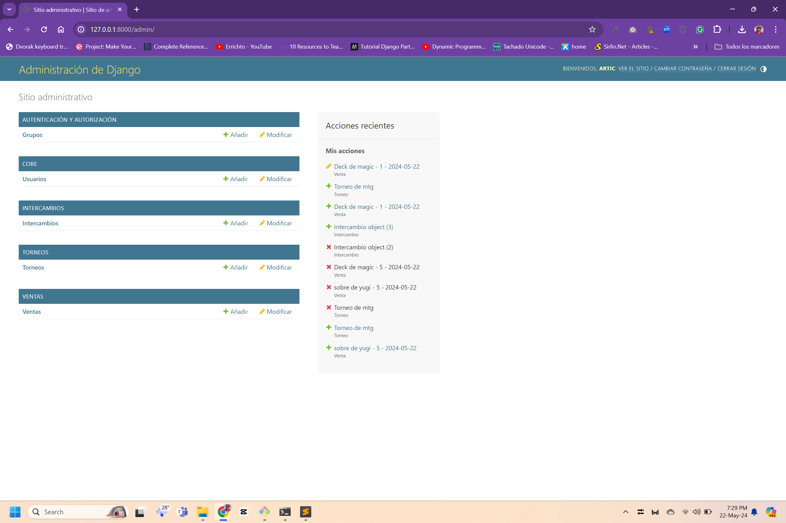

# Monedero Local Game Store

> Tu mejor aliado en tu tienda de cartitas.

El proyecto tiene 4 apps

el app principal, llamado CORE. Solo contiene saldo y saldo regalo
app ventas, se encarga de las ventas de momento te carga el 3% del monto, al app actual le falta un campo para describir
app intercambios, ve las cosas que nos avientan los jugadores, agregamos el 100% 
app torneos va a crear una compra grupal, me dijo gabo que ya estas mas o menos familiarizado con el concepto.

Implementaciones futuras:
 
-Blog/pagina de la tienda
-apartado de videos (vinculado al usuario, como el udemy)
-tienda virtual
-pagina de usuario (donde muestra su informacion, logros, eventos, etc)

## Built With

- Django,
- HTML & CSS,
- amor
## Live Demo

no hay version demo, vuelva mañana

